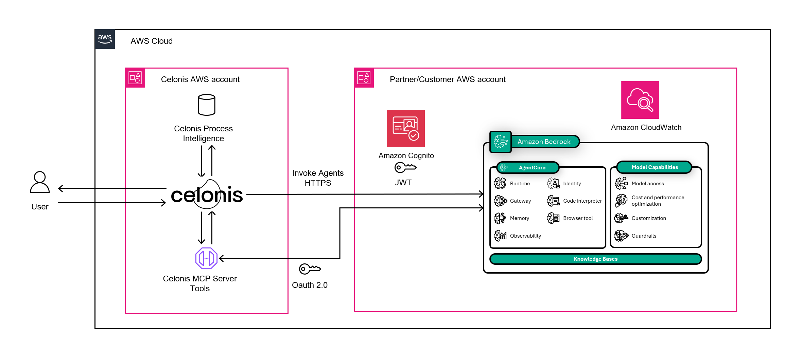

# Celonis Process Agent on Amazon Bedrock AgentCore

> **⚠️ Educational sample code.** This project demonstrates an integration pattern. It is not production-ready and does not constitute legal, security, or compliance approval for the Celonis integration. Before production use, complete the [Pre-Deployment Verification Checklist](SECURITY.md#pre-deployment-verification-checklist) and review [SECURITY.md](SECURITY.md).

A Strands agent that connects to Celonis MCP Server via Amazon Bedrock AgentCore Gateway, deployed on Amazon Bedrock AgentCore Runtime. Includes Amazon Cognito JWT authentication so the agent can be invoked directly from Celonis Action Flows.

## Architecture



```
Celonis Action Flow / Client
  │                          ▲
  │  HTTP POST               │  JSON response
  │  (Cognito JWT token)     │
  ▼                          │
AgentCore Runtime (JWT authorizer)
  │                          ▲
  │  Strands Agent +         │  Tool results
  │  Amazon Bedrock LLM      │
  ▼                          │
AgentCore Gateway (AWS IAM SigV4)
  │                          ▲
  │  MCP protocol            │  MCP responses
  │  (OAuth2 via Identity)   │
  ▼                          │
Celonis MCP Server
```

The agent works bidirectionally with Celonis:

- Celonis calls the agent via POST request (e.g., from an Action Flow) to get AI-powered answers about process data
- The agent calls back into Celonis via MCP tools to query data or trigger Action Flows

Inbound: clients authenticate with a Cognito JWT (client_credentials grant).
Outbound: the Gateway handles Celonis OAuth2 tokens via Amazon Bedrock AgentCore Identity — no credentials in agent code.

## Prerequisites

- Python 3.11+
- AWS CLI configured
- Amazon Bedrock AgentCore Starter Toolkit (`pip install bedrock-agentcore-starter-toolkit`)
- The chosen Amazon Bedrock model **enabled in Model Access** for your deployment region
- A [Celonis](https://www.celonis.com/) account with MCP Server access and OAuth2 app credentials (see [Third-Party Services](#third-party-services))
- **Production:** [AWS CloudTrail](https://docs.aws.amazon.com/awscloudtrail/latest/userguide/cloudtrail-create-a-trail-using-the-console-first-time.html) enabled in your account for security audit logging (see [SECURITY.md](SECURITY.md#access-logging-and-audit))

> **Note:** CloudTrail is an account-level service and is not provisioned by this sample's CloudFormation template. For production deployments, set it up before deploying. See [SECURITY.md](SECURITY.md#access-logging-and-audit) for setup commands.

## Quick Start

### 1. Set your AWS region

All commands use your AWS CLI default region. Set it once:

```bash
aws configure set region us-east-1
```

### 2. Install

```bash
python -m venv .venv
.venv\Scripts\pip install -r requirements.txt
```

### 3. Provision AWS resources (CloudFormation)

> **First-time model access:** Amazon Bedrock models auto-enable on first invocation. For Anthropic models served via AWS Marketplace, the first invocation triggers a subscription — the template's IAM role includes the required Marketplace permissions (`aws-marketplace:ViewSubscriptions`, `aws-marketplace:Subscribe`) to handle this automatically.

```bash
aws cloudformation deploy \
  --template-file template.yaml \
  --stack-name celonis-agentcore \
  --capabilities CAPABILITY_NAMED_IAM \
  --parameter-overrides \
    CelonisMcpServerUrl=<your Celonis MCP server URL> \
    CelonisTokenUrl=<your Celonis OAuth2 token URL> \
    CelonisClientId=<your Celonis client ID> \
    CelonisClientSecret=<your Celonis client secret> \
    BedrockModel=claude-sonnet-4.6
```

Replace the `<...>` placeholders with your Celonis values. `BedrockModel` defaults to `claude-sonnet-4.6` if omitted.

#### CloudFormation Parameters

| Parameter | Description | Default |
|---|---|---|
| `CelonisMcpServerUrl` | Celonis MCP Server endpoint URL | (required) |
| `CelonisTokenUrl` | Celonis OAuth2 token endpoint | (required) |
| `CelonisClientId` | Celonis OAuth2 client ID | (required) |
| `CelonisClientSecret` | Celonis OAuth2 client secret | (required) |
| `CelonisOAuthScope` | OAuth scope for Celonis MCP | `mcp-asset.tools:execute` |
| `BedrockModel` | Model to use (see table below) | `claude-sonnet-4.6` |

#### Supported Models

| Value | Model |
|---|---|
| `claude-sonnet-4.5` | Claude Sonnet 4.5 |
| `claude-sonnet-4.6` | Claude Sonnet 4.6 |
| `claude-opus-4.5` | Claude Opus 4.5 |
| `claude-opus-4.6` | Claude Opus 4.6 |
| `claude-opus-4.7` | Claude Opus 4.7 (most capable) |
| `claude-haiku-4.5` | Claude Haiku 4.5 (fast & cost-effective) |

#### Region Prefix (automatic)

This template uses **geographic cross-region inference**, which routes requests across multiple AWS regions within a geography (US, EU) for higher throughput while respecting data residency. The prefix is automatically derived from the deployment region.

| Prefix | Supported regions |
|---|---|
| `us` | us-east-1, us-east-2, us-west-1, us-west-2, ca-central-1, ca-west-1 |
| `eu` | eu-west-1, eu-west-2, eu-west-3, eu-central-1, eu-central-2, eu-north-1, eu-south-1, eu-south-2 |

> **Note:** This template only supports US and EU regions. Deploying to other regions (APAC, Middle East, etc.) requires additional configuration for global cross-region inference. Not all models are available in all geographies — check the [Amazon Bedrock model cards](https://docs.aws.amazon.com/bedrock/latest/userguide/model-cards.html) for current regional availability.

To add support for other regions, add the region to the `RegionToPrefix` mapping in `template.yaml` with the appropriate geo prefix (e.g. `au` for Sydney/Melbourne, `jp` for Tokyo/Osaka).

### 4. Sync stack outputs

```bash
python sync_stack_outputs.py
```

Populates `.bedrock_agentcore.yaml`, `Dockerfile`, and `.env` with the Gateway URL, model ID, execution role, and Cognito config from the stack. Run this after every `cloudformation deploy`.

### 5. Deploy the agent

```bash
agentcore launch
```

> **Note:** `.bedrock_agentcore.yaml` is gitignored. A clean template (`.bedrock_agentcore.yaml.example`) is committed instead. The sync script creates it from the example on first run.

### 6. Set agent ID

Grab the agent ID from `.bedrock_agentcore.yaml` and set it in `.env`:

```
AGENTCORE_AGENT_ID=celonis_process_agent-XXXXXXXXXX
```

### 7. Test

```bash
python test_remote.py
python test_remote.py "What are the top bottlenecks in PO processing?"
```

`test_remote.py` reads Cognito credentials directly from the CloudFormation stack — no `.env` configuration needed for testing.

## Switching Models or Regions

To change the model or deploy to a different region, update the stack:

```bash
aws cloudformation deploy \
  --template-file template.yaml \
  --stack-name celonis-agentcore \
  --capabilities CAPABILITY_NAMED_IAM \
  --parameter-overrides \
    ... \
    BedrockModel=claude-opus-4.7
```

Then sync and redeploy the agent:

```bash
python sync_stack_outputs.py
agentcore deploy
```

## Invoking the Agent

The agent accepts POST requests with a JSON body:

```json
{"prompt": "What processes are available?"}
```

The invocation endpoint URL follows this pattern:

```
https://bedrock-agentcore.{region}.amazonaws.com/runtimes/{url_encoded_agent_arn}/invocations?qualifier=DEFAULT
```

### From Celonis Action Flow

Use the [HTTP2 (Action Flow)](https://docs.celonis.com/en/http2--action-flow-.html) module, which supports OAuth 2.0 `client_credentials` flow natively.

1. Create an HTTP2 OAuth 2.0 connection:
   - Flow type: `Client Credentials`
   - Token URI: `CognitoTokenUrl` from stack outputs
   - Scope: `celonis-agent/invoke`
   - Client ID: `CognitoClientId` from stack outputs
   - Client Secret: retrieve via `aws cognito-idp describe-user-pool-client`
   - Token placement: `Header` (default)
   - Header token name: `Bearer` (default)

   Get these values with: `aws cloudformation describe-stacks --stack-name celonis-agentcore --query "Stacks[0].Outputs"`

2. Configure the HTTP2 request:
   - URL: `https://bedrock-agentcore.{region}.amazonaws.com/runtimes/{url_encoded_agent_arn}/invocations?qualifier=DEFAULT`
   - Method: `POST`
   - Body type: `Raw`
   - Content type: `application/json`
   - Body: `{"prompt": "your question"}`

The HTTP2 module handles token fetching and refresh automatically.

### Getting a Cognito token manually

```
POST <COGNITO_TOKEN_URL>
Content-Type: application/x-www-form-urlencoded
Authorization: Basic base64(CLIENT_ID:CLIENT_SECRET)

grant_type=client_credentials&scope=celonis-agent/invoke
```

The values for `COGNITO_TOKEN_URL`, `COGNITO_CLIENT_ID`, and `COGNITO_CLIENT_SECRET` are available in the CloudFormation stack outputs (`aws cloudformation describe-stacks --stack-name celonis-agentcore`).

## Local Development

Test directly against Celonis MCP (no Gateway):

```bash
python test_local.py
```

This verifies the Celonis MCP connection works with your credentials.

## Observability

The agent uses [AgentCore native observability](https://docs.aws.amazon.com/bedrock-agentcore/latest/devguide/observability.html) powered by AWS Distro for OpenTelemetry (ADOT). No telemetry code is needed in `agent.py` — the Strands framework emits OpenTelemetry spans automatically, and ADOT (via `opentelemetry-instrument` in the Dockerfile CMD) exports them to CloudWatch.

### What gets traced

- Agent invocation (full lifecycle)
- Each LLM call (model ID, token usage, latency)
- Each MCP tool call (name, duration, inputs/outputs, success/error)
- Event loop cycles (reasoning steps)

### Setup (one-time per account)

Enable CloudWatch Transaction Search so spans are queryable. This is an **account-level, one-time** setup — it is not handled by `agentcore deploy`:

```bash
aws xray update-trace-segment-destination --destination CloudWatchLogs
```

> If Transaction Search is already enabled in your account (from prior work), you can skip this — it's account-wide. Per-agent tracing is enabled automatically via `observability: enabled: true` in `.bedrock_agentcore.yaml`.

### Where to view traces

| Location | How to access |
|---|---|
| GenAI Observability dashboard | CloudWatch → Application Signals → GenAI Observability → Amazon Bedrock AgentCore |
| Transaction Search (raw spans) | CloudWatch → Application Signals → Transaction Search → `aws/spans` |
| Application logs (stdout) | CloudWatch → Log groups → `/aws/bedrock-agentcore/runtimes/<agent-id>-DEFAULT/runtime-logs` |

### Configuration (Dockerfile)

| ENV variable | Purpose |
|---|---|
| `OTEL_RESOURCE_ATTRIBUTES=service.name=celonis-process-agent` | Service name shown in dashboards |
| `OTEL_SEMCONV_STABILITY_OPT_IN=gen_ai_latest_experimental` | Includes tool inputs/outputs in span data |

## Cleanup

Delete the agent runtime and all AWS resources:

```bash
agentcore destroy
aws cloudformation delete-stack --stack-name celonis-agentcore
```

`agentcore destroy` removes the AgentCore Runtime, ECR repository, and CodeBuild project.
`delete-stack` removes the IAM roles, Gateway, OAuth2 provider, and Cognito pool.

## Files

| File | Purpose |
|---|---|
| `agent.py` | Strands agent connecting to Celonis via Gateway |
| `template.yaml` | CloudFormation template — provisions all AWS resources |
| `sync_stack_outputs.py` | Populates local config from CFN stack outputs for `agentcore launch` |
| `test_remote.py` | Tests deployed agent with Cognito JWT |
| `test_local.py` | Tests direct Celonis MCP connection locally |
| `celonis_oauth.py` | OAuth2 token provider for local dev |

## AWS Resources Created

| Resource | Name |
|---|---|
| Cognito User Pool | `CelonisAgentCorePool` |
| IAM Role (Runtime) | `CelonisAgentCoreRuntime-{region}` |
| IAM Role (Gateway) | `CelonisAgentCoreGateway-{region}` |
| AgentCore Identity | `celonis-oauth-provider` |
| AgentCore Gateway | `celonis-mcp-gateway` |
| Gateway Target | `cel` |

## Security

This is educational sample code. Review and harden it before any production use. See [SECURITY.md](SECURITY.md) for the full security model, including the shared responsibility split, threat model and trust boundaries, per-service guidelines (IAM, Amazon Cognito, AWS Secrets Manager, Amazon Bedrock, Amazon ECR, CloudWatch), encryption and key management, data classification, access logging and audit, compliance considerations, and operational risks.

## Third-Party Services

This sample integrates with [Celonis](https://www.celonis.com/), a third-party process mining platform. To use this sample, you must have your own Celonis account with access to the Celonis MCP Server and valid OAuth2 application credentials. Your use of Celonis is governed by the [Celonis Terms of Service](https://www.celonis.com/terms-of-service/) and is separate from your use of AWS services. AWS is not responsible for Celonis services, and Celonis is not responsible for AWS services.

Before connecting production data, review the [Third-Party Integration Responsibilities](SECURITY.md#third-party-integration-responsibilities) in SECURITY.md (right to use, security review, data sharing, and approval).

## License

This sample code is licensed under the MIT-0 License. See the [LICENSE](LICENSE) file.
